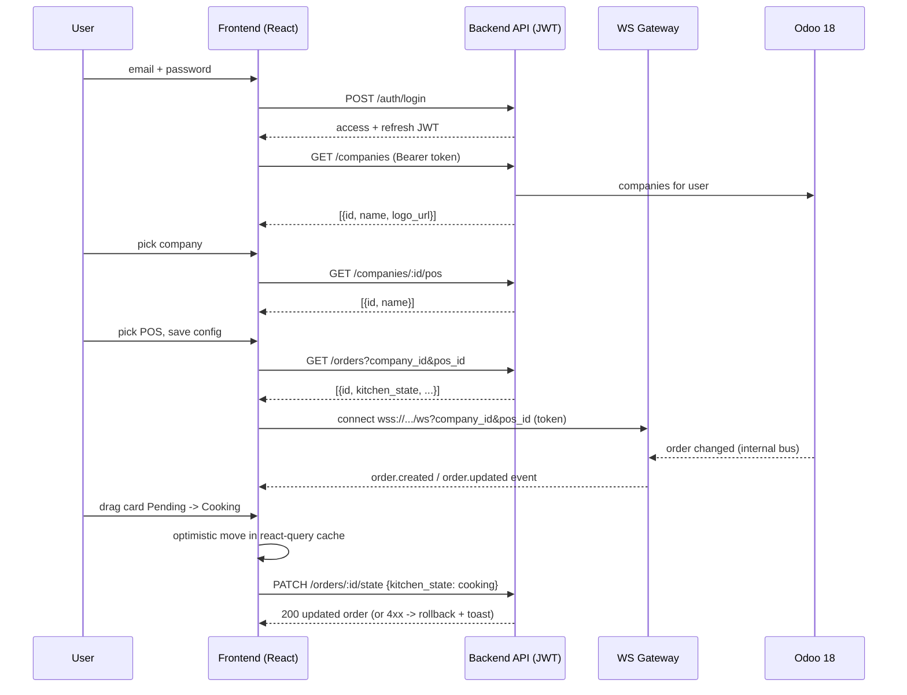

# Kitchen Display System (KDS) — Design

## Stack
- React 19 + Vite 6 + Tailwind CSS 4 (all latest at build time)
- **@dnd-kit/core** + **@dnd-kit/sortable** for drag-and-drop (react-beautiful-dnd is unmaintained; dnd-kit is the maintained, tree-shakeable, React-19-safe choice)
- **@tanstack/react-query** for server-state (fetch caching, dedup, optimistic mutations, retry) — covers the same dedup need SWR would, but its mutation API is a better fit for optimistic drag-and-drop
- **Zustand** for the small slice of client-only state (auth tokens, active tenant/config, ws status) — no Redux; state is tiny
- **MSW (Mock Service Worker)** intercepting `fetch` at the real contract URLs, so flipping `VITE_USE_MOCKS=false` + setting `VITE_API_BASE_URL`/`VITE_WS_URL` is the *only* change needed for the real backend
- **React Router** for the 3 routes: `/login`, `/config`, `/board`

## Folder structure (atomic design)
```
src/
  api/                # thin client: axios/fetch wrapper, endpoint functions, react-query hooks
    client.js
    auth.js
    companies.js
    orders.js
    mocks/            # MSW handlers + seed fixtures (dev-only, tree-shaken from prod build)
      handlers.js
      fixtures.js
      browser.js
  ws/
    kitchenSocket.js   # reconnect/backoff socket wrapper
    useKitchenSocket.js # hook: subscribes, feeds events into react-query cache
  store/
    authStore.js        # zustand: access token (memory), user
    tenantStore.js       # zustand + localStorage: selected company/pos, persisted per-tenant key
  components/
    atoms/               # Button, Input, Badge, Spinner, Avatar, StatusDot
    molecules/            # FormField, CompanySelect, ConnectionStatus, OrderMeta
    organisms/             # LoginForm, ConfigForm, KanbanColumn, OrderCard, KanbanBoard
    templates/               # AuthLayout, AppShell (header + logout)
  pages/
    LoginPage.jsx
    ConfigPage.jsx
    BoardPage.jsx
  hooks/                 # useAuth, useCompanies, usePointsOfSale, useOrders, useUpdateOrderState
  types/                  # JSDoc typedefs or .d.ts for Order, Company, Pos, User
  routes/AppRouter.jsx
  App.jsx, main.jsx
docs/
  api-contract.md         # human-readable contract (primary deliverable for backend team)
  openapi.yaml            # formal OpenAPI 3.1 spec
  websocket-events.md      # WS event schema
```

## Data flow (Mermaid)


## State management
- **Server state** (companies, pos list, orders): `@tanstack/react-query`. Orders query key: `['orders', companyId, posId]`. WS events call `queryClient.setQueryData` to merge in-place (no refetch storm); a `staleTime` + focus-refetch acts as a safety net if an event is ever missed.
- **Client state**: `authStore` (access token in memory only — never persisted, to limit XSS blast radius; refresh token in `localStorage` under a tenant-namespaced key, per requirements' accepted tradeoff — flagged as a ceiling: a same-site httpOnly-cookie refresh token would be stronger, backend team's call once they own the auth endpoints). `tenantStore` persists `{companyId, posId}` in `localStorage['kds:<companyId>:config']` so switching companies never clobbers another tenant's saved config on a shared device.
- Optimistic DnD: `useUpdateOrderState` mutation does `onMutate` (move card + snapshot), `onError` (rollback snapshot + toast), `onSettled` (invalidate to reconcile) — standard react-query optimistic pattern, no bespoke rollback machinery.

## Drag-and-drop
- One `DndContext` in `KanbanBoard`, one `SortableContext`/droppable per column (`pending`, `cooking`, `ready`, `served`).
- `onDragEnd` reads the destination column id, calls `useUpdateOrderState.mutate({orderId, kitchen_state: destColumnId})`. No server call during drag — only on drop, to avoid chatty PATCH storms.
- Cards render via a memoized `OrderCard` (rerender-memo) keyed by `order.id` + `updated_at` so unrelated column re-renders don't re-render every card.

## WebSocket client design
- `kitchenSocket.js`: small class wrapping native `WebSocket`. Exponential backoff (1s → 30s cap, jitter), max silent-fail before switching UI to "polling" mode.
- `useKitchenSocket(companyId, posId)`: opens one socket per mount via a `useRef` (advanced-event-handler-refs — avoid reconnecting on every render), tears down on unmount/scope change, exposes `connectionStatus: 'connected' | 'reconnecting' | 'polling'`.
- Fallback: when status is `polling`, `useOrders` query switches its `refetchInterval` from `false` to e.g. `5000`ms — react-query already supports this via a state-driven option, no separate polling code path.
- `ConnectionStatus` molecule renders the dot the reference screenshot shows ("Session aktif" pattern), reused for WS status.

## Multi-tenant / branding
- `GET /tenant/config` (public, no auth) returns `{name, logo_url, primary_color}` used for header branding — matches the "Outlet - Kawah Putih" / logo header in the reference screenshot, but data-driven per tenant instead of hardcoded.
- Tailwind theme reads 1-2 CSS custom properties (`--brand-primary`) set at runtime from that response, so no rebuild is needed per tenant.

## Security notes for backend (non-binding, contract appendix)
- `kitchen_state` transitions should probably be validated server-side too (e.g. can't jump `served → pending` without explicit reason) — frontend does not enforce transition rules, only offers all 4 columns as drop targets. Flag for backend sign-off.
- Company list endpoint must filter by the authenticated user's allowed companies (`res.users.company_ids`) — never trust a client-supplied company_id without checking it's in that set.

## Testing strategy
- Component: React Testing Library for `KanbanBoard` (drag simulated via dnd-kit test utils) and `LoginForm`/`ConfigForm` validation.
- API layer: MSW handlers double as both dev mocks and test fixtures (one source of truth).
- One smoke test per page route via Vitest + RTL. No e2e framework added speculatively — Playwright can be added when there's a real backend to point at.

## Revision 2 (2026-09-16) — line-level kitchen state

- **Entity redesign**: `Order`+`OrderLine` collapsed into a single flat `OrderLineCard` (`id, order_id, order_name, table_number, customer_name, product_name, qty, kitchen_state, created_at, updated_at`). One card = one `sale.order.line`. `table_number` = parent order's `client_order_ref`.
- **API**: `GET /orders` + `PATCH /orders/{id}/state` replaced by `GET /order-lines` + `PATCH /order-lines/{id}/state`. Backend queries `sale.order.line` directly, joined to `sale.order` for the table/customer/order-name fields — no nested payload, no client-side flattening.
- **WebSocket**: `order.*` events renamed `order_line.*`, payload is the same `OrderLineCard` shape used by REST (one shape everywhere, per ponytail — don't maintain two).
- **Frontend files renamed accordingly**: `useOrders``→`useOrderLines`, `useUpdateOrderState``→`useUpdateLineState`, `OrderCard`/`KanbanColumn`/`KanbanBoard` now operate on `cards` (lines) instead of `orders`.
- **Branding**: new `useApplyBranding()` hook (`src/hooks/useApplyBranding.js`), mounted once in `App.jsx`, sets `--brand-primary`/`--brand-secondary` CSS custom properties from `/tenant/config` at runtime. `KanbanColumn`'s drag-over highlight now uses `--brand-secondary` so both configured colors are visibly wired end-to-end, not just documented.
- **Wording**: all UI strings (labels, buttons, empty states, elapsed-time text) translated to English. Demo fixture data (product names, customer names, POS names) also anglicized for consistency; tenant/company sample names (e.g. "Kawah Putih") were left as-is since they're configurable business identity data, not app wording.

## Revision 3 (2026-09-16) — drop POS, single color

- **Scoping**: `company_id` is now the only scope for `/order-lines` and the WebSocket connection. `posId`/`posName` removed from `tenantStore`, `useOrderLines`, `useUpdateLineState`, `useKitchenSocket`, `kitchenSocket`, and the mock handlers/fixtures/wsMock.
- **ConfigForm**: Point of Sale `<select>` removed entirely — just Company + Save.
- **Branding**: `TenantConfig.primary_color`/`secondary_color` collapsed into `TenantConfig.color`. `useApplyBranding` now sets only `--brand-primary`. `KanbanColumn`'s drag-over highlight reverted to `bg-brand/10` (was `bg-brand-secondary/10`).
- **Logo**: `AuthLayout` and `AppShell` both accept a `logoUrl` prop and render an `` when present, falling back to the existing colored-block placeholder.
- **Defaults**: `mockTenantConfig` is now `{name: 'FOOM Outlet', logo_url: '', color: '#9333ea'}`.

## Revision 4 (2026-09-16) — color out of the API, into localStorage

- **New store**: `src/store/themeStore.js` — Zustand + `persist` (key `kds_theme`), holds `{primaryColor, secondaryColor}`, defaults `{'#9333ea', '#f97316'}`. This is a sibling of `tenantStore`/`authStore`, not a query result — there is no `useQuery` involved, so no network round-trip and no loading state for color.
- **`TenantConfig` shrinks to `{name, logo_url}`** — `color` removed from the typedef, `mockTenantConfig`, `openapi.yaml`'s schema, and every doc. `GET /tenant/config` no longer has any color-related field to build.
- **`useApplyBranding` rewritten** to read `useThemeStore` instead of `useTenantConfig`, and now sets both `--brand-primary` and `--brand-secondary` custom properties (secondary returns, having been dropped in Revision 3's single-color simplification — now it's back, but local instead of API-driven).
- **`index.css`**: `--brand-secondary` / `--color-brand-secondary` tokens restored alongside `--brand-primary`.
- **`ConfigForm`**: two `<input type="color">` pickers (Primary/Secondary) added below the Company select, bound directly to `useThemeStore` — each `onChange` calls `setColors(...)`, which zustand's `persist` middleware writes to `localStorage` immediately, independent of the form's own Save button (Save still only governs company selection/navigation).
- **Secondary color given a real use**: `Badge` gains an `accent` tone (`bg-brand-secondary/15 text-brand-secondary`), used for the table-number badge on `OrderCard` — so both configured colors are visibly applied, not just plumbed through unused.
- **Test cleanup**: `src/test/setup.js` resets `useThemeStore` to `DEFAULT_THEME` in `afterEach` (alongside the existing auth/tenant resets) so color changes in one test don't leak into the next.
